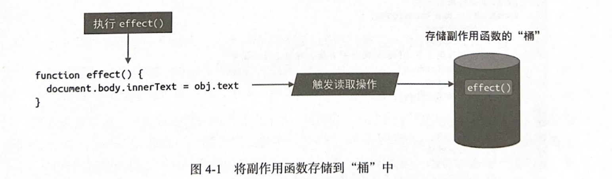
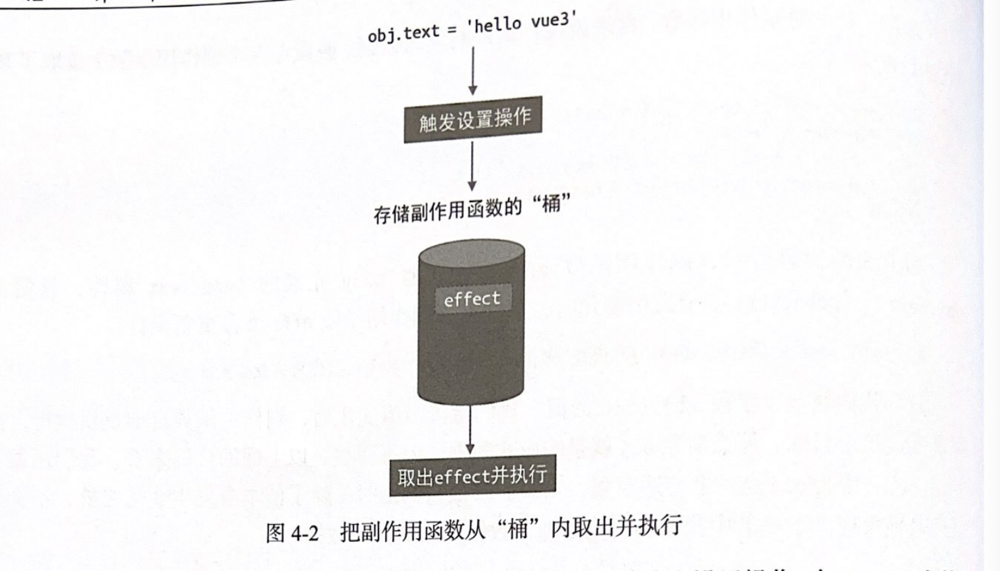
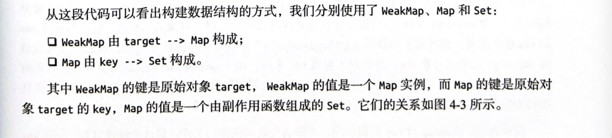
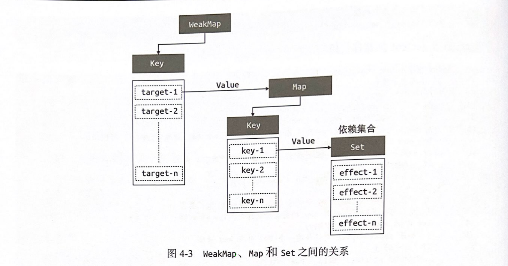

# vuejs设计与实现
## 第一章权衡的艺术

### 1.1命令式和声明式
命令式,代码描述的是做事的过程
```js
$('app')
    .text('hello')
    .on('click',()=>{alert(1)})
```
声明式,它更关注结果
```js
<div @click="() => alert('ok')"> hello</div>
```
### 1.2 性能与可维护性的权衡
> 声明式性能不优于命令式，代码维护性高于命令式

### 1.3 虚拟DOM的性能到底如何

vuejs性能消耗= 找出差异的性能消耗 +  更改差异性能的消耗，
这就是为啥理论上虚拟DOM性能不可能比原声js操作DOM高

创建DOM的时候，虚拟DOM和原声创建差距不大，更新的时候，虚拟DOM比原声快


### 1.4 运行时和编译时
三种选择：纯运行时，运行时+编译时，纯编译时

纯运行时不能为用户做出优化，纯编译时又失去了灵活性，所以vue采用**运行时+编译时**，Svelte采用纯编译时

## 第2章 框架设计的核心要素

### 2.1 提升用户的开发体验
衡量一个框架是否优秀的指标之一就是看他开发体验如何，所以vue为我们做了大量开发时的错误警告提示

vue3.0的console优化
> 打开控制台，找到Console=〉Enable custom formatters

### 2.2 控制框架代码的体积

学会用环境变量控制输出体积，进行Tree-Shaking

### 2.3 框架要做到良好的Tree-Shaking

Tree-Shaking
> 消除那些永远不会被执行的代码，也就是排除dead code，想要支持tree-shaking，模块必须时ESM

副作用
>  当执行她的时候会影响外部，

在rollup中，webpack可以使用`/*#__PURE__*/`告诉编译去删除该代码

### 2.4 框架应该输出怎么样的构建产物

需要根据不同环境生成不同的产物

vuejs中通过script引入的产物，打包的时候生成的是IIFE 立即调用的函数表达式`（function(){})()`

也有esmodule产物 `<script type="module" src="/vue.esm-browser.js"></script>`,
查看vuejs源码的`package/vue/package.json`该文件的 `module: dist/vue.runtime.esm-bundler.js `
带有bundler字段esm资源的是给打包工具使用的，而browser的esm是直接给浏览器`script type=module`用的


### 2.5 特性开关
在框架设计时需要给功能或特性加入开关


如果明确不使用options API那么可以设置插件的这个属性，减少打包体积 `new webpack.DefinePlugin({__VUE_OPTIONS_API__: JSON.stringify(true)})`


### 2.6 错误处理

统一处理错误，同时为用户提供注册处理错误的方法，vue中搜索 callWithErrorHandling函数，注册处理错误的函数

app.config.errorHandler = () => {}

### 2.7 良好的ts类型支持

优势： 代码及文档，编辑器自动提示

vuejs中 `runtime-core/src/apiDefineComponents`文件，在浏览器里执行的只有3行，全部代码200多行，
基本都是为了类型支持服务

## 第三章

### 3.1 声明式的描述UI

模版方式 `<div id="test" :name="name" @click="say">hello</div>`

可以看到，在vuejs中，ui 数据 事件都有与之对应的描述方式，用户不需要手写任何命令式代码，这就是声明式地描述UI


除了模版方式，还以用js对象来描述，相相比模版描述，使用js对象描述比模版更加灵活。其实用js对象描述UI的方式，就是虚拟DOM

```js
const title = {
    tag: 'h1',
    props:{
        onClick: handler
    },
    children: [{
        tag: 'span'
    }]
}
```

### 3.2 初识渲染器

渲染器的作用就是把虚拟DOM渲染为真实DOM

简易渲染器,


```js
// Vnode
const vnode = {
    tag:'div',
    props: {
        onClick: () => alert('hello')
    },
    children:'click me'
}
// renderer 把vnode渲染为真实DOM

function renderer(vnode, container) {
    const el = document.createElement(vnode.tag)
    for(const key in vnode.props) {
        if(/^on/.test(key)) {
            el.addEventListener(
                key.substr(2).toLowerCase(),
                vnode.props[key]
            )
        }
    }
    if(typeof vnode.children === 'string') {
        el.appendChild(document.createTextNode(vnode.children))
    } else if(Array.isArray(vnode.children)) {
        vnode.children.forEach(child => renderer(child, el))
    }
    container.appendChild(el)
}


```


当vnode变化的时候，**渲染器需要找到对应的变化点**，更新变化点内容。

### 3.3 组件的本质

虚拟DOM可以描述真实DMO之外，还可以描述组件

> 组件就是一组DOM元素的封装，这组DOM元素就是组件要渲染的内容，因此可以定义一个函数来代表组件，函数对返回值就代表组件要渲染的内容

```js
const MyComponent = function () {
    return {
        tag: 'div',
        props: {
            onClick: () => alert('jello')
        },
        children: 'click me'
    }
}
// tag 存储组件
const vnode = {
    tag: MyComponent
}
// 修改renderer函数，以渲染组件

function renderer(vnode,container) {
    if(typeof vnode.children === 'string') {
        mountElement(vnode, container)
    } else if(typeof vnode.tag === 'function') {
        mountComponent(vnode,container)
    }
}

function mountElement(vnode,container) {
    const el = document.createElement(vnode.tag)
    for(const key in vnode.props) {
        if(/^on/.test(key)) {
            el.addEventListener(
                key.substr(2).toLowerCase(),
                vnode.props[key]
            )
        }
    }
    if(typeof vnode.children === 'string') {
        el.appendChild(document.createTextNode(vnode.children))
    } else if(Array.isArray(vnode.children)) {
        vnode.children.forEach(child => renderer(child, el))
    }
    container.appendChild(el)
}


function mountCompoent(vnode, container) {
    const subtree = vnode.tag()
    renderer(subtree, container)
} 
```

> 用对象表示组件(vue中的有状态组件就是用对象表示)，对象有个render函数，它的返回值表示组件要渲染的内容

```js{4,9}
function renderer(vnode,container) {
    if(typeof vnode.children === 'string') {
        mountElement(vnode, container)
    } else if(typeof vnode.tag === 'object') {
        mountComponent(vnode,container)
    }
}

function mountCompoent(vnode, container) {
    const subtree = vnode.tag.render()
    renderer(subtree, container)
} 

```

## 3.4 模版的工作原理

编译器的作用其实就是将模版编译为渲染函数

```js
<div @click="hander">me</div>


render() {
    return h('div', {onClick: hander}, 'me')
}
```

无论是模版还是手写渲染函数，对于一个组件来说，它要渲染的内容最终都是通过渲染函数产生的，然后渲染器在把渲染函数返回的虚拟DOm渲染为真实DOm，
这就是模版工作的原理，也是vuejs渲染页面的流畅


## 第4章 响应系统的作用与实现

### 4.1 响应式数据和副作用函数

**副作用函数**是指会产生副作用的函数,effect函数支持的时候，会设置body的文本内容，因此effect函数产生了副作用。

effect1函数执行改变了全局变量，所以也是一个副作用函数
```js
function effect() {
    document.body.innerText = 'hello vue2'
}
let val = 1
function effect1() {
    val = 2
}
```

**响应式数据**当我们修改了数据值，能自动执行副作用函数，那么这个数据就是响应式数据。

```js
const obj = {text:'hello word'}
function effect() {
    document.body.innerText =obj.text
}
obj.text ='hello vue2'
```

### 4.2 响应式数据的基本实现
响应式数据特点
1. 副作用函数执行时，会触发数据的getter操作
2. 数据变更的时候会触发setter操作

如果我们能拦截数据的读取和设置操作，我们就可以实现响应式数据





vue2中可以用`Object.defineProperty`实现拦截，在vue3中我们用Proxy实现
```js
// 存储副作用函数
const bucket = new Set()

const data = {text:'hello word'}

const obj = new Proxy(data, {
    get(target, key) {
        bucket.add(effect)
        return target[key]
    },
    set(target, key, nv) {
        target[key] = nv
        bucket.forEach(effect => effect())
        return true
    }
})
```

### 4.3 设计一个完善的响应式系统

响应式系统的工作流

1. 当读取操作发生的时候，将副作用函数收集到桶里
2. 当设置操作发生的时候，从桶里取出副作用函数并执行

提供一个用来注册副作用函数的机制

```js
let activeEffect
function effect(fn) {
    activeEffect = fn
    fn()
}

```

修改桶的数据结构，以实现副作用函数与被操作的目标字段之间建立明确的联系，如下关系图

```js
effect(function fn1(){obj.text})
effect(function fn2(){obj.text})
effect(function fn3(){obj.name})
effect(function fn4(){obj.sex;obj.age})


target
├── text
|   ├── fn1  
|   ├── fn2  
├── name
|   ├── fn3  
├── sex
|   ├── fn4  
├── age
|   ├── fn4  


```

为了实现上述数据结构，我们使用**weakMap**代替Set作为桶的数据结构

```js
let activeEffect
const bucket = new WeakMap()
const obj = new Proxy(data, {
    get(target,key) {
        if(!activeEffect) return target[key]

        let depsMap = bucket.get(target)
        if(!depsMap) {
            depsMap.set(target,(depsMap = new Map()))
        }
        let deps = depsMap.get(key)
        if(!deps) {
            deps.set(key, (deps = new Set()))
        }
        deps.add(activeEffect)
        return target[key]
    },
    set(target,key,nv) {
        target[key] = nv
        const depsMap = bucket.get(target)

        if(!depsMap) return 
        const effects = depsMap.get(key)
        
        effects && effects.forEach(fn =>fn())

    } 
})
```



我们把 Set数据结构存储的副作用函数集合称为key的依赖集合

将代码做封装处理

```js
const obj = new Proxy(data, {
    get(target,key) {
        track(target,key)
        return target[key]
    },
    set(target,key,nv) {
        target[key] = nv
        trigger(target,key)
    }
})

function track(target,key) {
    if(!activeEffect) return target[key]

        let depsMap = bucket.get(target)
        if(!depsMap) {
            bucket.set(target,(depsMap = new Map()))
        }
        let deps = depsMap.get(key)
        if(!deps) {
            depsMap.set(key, (deps = new Set()))
        }
        deps.add(activeEffect)
}
function trigger(target,key){
    const depsMap = bucket.get(target)
    if(!depsMap) return 
    const effects = depsMap.get(key)
    
    effects && effects.forEach(fn =>fn())
}
```

### 4.4 分支切换与cleanup

分支切换的定义，如下代码

```js
const data = {ok:true, text:'hello word'}
const obj = new Proxy(data,{})
effect(function effectFn(){
    document.bodu.innerText = obj.ok ? obj.text : 'not'
})
```

副作用函数第一次执行时的依赖关系
```
obj
├── ok
|   ├── effectFn  
├── text
|   ├── effectFn  
```

当我们执行`obj.ok = false`后，不希望obj.text对应的副作用函数执行。所以我们每次副作用函数执行时，可以把它所有与之关联的依赖集中删除

当`obj.ok = false`，我们执行副作用函数，此时我们依赖关系是

```
obj
├── ok
|   ├── []  
├── text
|   ├── []  
```
当副作用函数执行完毕后,把副作用函数加入

```
obj
├── ok
|   ├── effectFn
├── text
|   ├── []  
```

所以，我们在effect内部定义了新的effectFn函数，并为其添加`effectFn.deps`属性，该属性是一个数组，用了存储所有包含当前副作用函数的依赖集合


```js{3-7}
let activeEffect
function effect(fn) {
    const effectFn = () => {
        cleanup(effectFn)
        activeEffect = fn
        fn()
    } 
    effectFn.deps = []
    effectFn()
}


function track(target,key) {
    if(!activeEffect) return target[key]
    let depsMap = bucket.get(target)
    if(!depsMap) {
        bucket.set(target,(depsMap = new Map()))
    }
    let deps = depsMap.get(key)
    if(!deps) {
        depsMap.set(key, (deps = new Set()))
    }
    deps.add(activeEffect)
    activeEffect.deps.push(deps)
}

function cleanup(effectFn) {
    for(let i =0;i<effectFn.length ;i++) {
        const deps = effectFn.deps[i]
        deps.delete[effectFn]
    }
    effectFn.deps.length = []
}

function trigger(target,key){
    const depsMap = bucket.get(target)
    if(!depsMap) return 
    const effects = depsMap.get(key)
    const effectsToRun = new Set(effects)
    effectsToRun && effectsToRun.forEach(fn =>fn())
}
```

### 4.5 嵌套的effect与effect栈

上面的代码问题在于只有一个全局变量activeEffect，如下当发生嵌套的时候，内层
effectFn2会将activeEffect设置为effectFn2，当执行obj.foo的依赖收集时，还是activeEffect还是effectFn2

```js

effct(function effectFn1() {
    console.log('effectFn1')
    effct(function effectFn2() {
        console.log('effectFn2')
        temp2 = obj.bar
    })
    temp1 = obj.foo
})
```

所以需要一个副作用栈实现

```js
let activeEffect
const effectStack = []
function effect(fn) {
    const effectFn = () => {
        cleanup(effectFn)
        activeEffect = fn
        effectStack.push(effectFn)
        fn()
        effectStack.pop()
        activeEffect = activeEffect[activeEffect.length -1]
    } 

    effectFn.deps = []
    effectFn()
}


```

### 4.6 避免无限递归循环
当执行下面代码时，我们上面的实现会无限递归
```js
const data = {foo:1}
const obj = new Proxy(data,{})
effct(() => obj.foo++)
```

解决方案：在trigger动作发生时增加守卫条件，如果trigger触发执行的副作用函数与当前正在执行的副作用函数相同，则不触发执行

```js
function trigger(target,key){
    const depsMap = bucket.get(target)
    if(!depsMap) return 

    const effects = depsMap.get(key)
    const effectsToRun = new Set()
    effects && effects.forEach(fn => {
        if(fn !== activeEffect) {
            effectsToRun.add(fn)
        }
    })
    effectsToRun && effectsToRun.forEach(fn => fn())
}


```

### 4.7 调度执行

当trigger动作触发副作用函数重新执行时，有能力决定副作用函数执行的时机，次数以及方式.

用户在调用effect函数注册副作用函数时，可以传递第二个参数options，它是一个对象，其中允许制定scheduler调度函数，同时在effect函数内部我们需要把options选项挂在到对应的副作用函数上


用scheduler控制执行的顺序
```js{20,37-41}
effect(() => {
    console.log(obj.foo)
}, {
    scheduler(fn) {

    }
})

let activeEffect
const effectStack = []
function effect(fn,options = {}) {
    const effectFn = () => {
        cleanup(effectFn)
        activeEffect = fn
        effectStack.push(effectFn)
        fn()
        effectStack.pop()
        activeEffect = activeEffect[activeEffect.length -1]
    } 
    effectFn.options = options
    effectFn.deps = []
    effectFn()
}

function trigger(target,key) {
    const depsMap = bucket.get(target)
    if(!depsMap) return 

    const effects = depsMap.get(key)
    const effectsToRun = new Set()
    effects && effects.forEach(fn => {
        if(fn !== activeEffect) {
            effectsToRun.add(fn)
        }
    })
    effectsToRun && effectsToRun.forEach((effectfn) =>{
        if(effectfn.options.scheduler) {
            effectfn.options.scheduler(effectfn)
        } else {
            effectfn()
        }
    })
}
```

使用flushJob控制副作用函数执行的次数

```js
const jobQueue = new Set()
const p = Promise.resolve()
let isFlushing = false

function  flushJob() {
    if(isFlushing) return 
    isFlushing = tuue
    p.then(() =>{
        jobQueue.forEach(job => job())
    }).finally(() => {
        isFlushing = false
    })
}

effect(() => {
    console.log(obj.job)
}, {
    scheduler(fn) {
        jobQueue.add(fn)
        flushJob()
    }
})
```

### 4.8 计算属性 computed 与lazy
实现计算属性

```js
effect(() => {
    console.log(obj.text)
}, {
    lazy: true
})


let activeEffect
const effectStack = []
function effect(fn,options = {}) {
    const effectFn = () => {
        cleanup(effectFn)
        activeEffect = fn
        effectStack.push(effectFn)
        // Todo 深入理解下
        const res = fn()
        effectStack.pop()
        activeEffect = activeEffect[activeEffect.length -1]
        // Todo 深入理解下
        return res
    } 
    effectFn.options = options
    effectFn.deps = []
    if(!options.lazy) {
        effectFn()
    }
    return effectFn // 注意
}

function computed(getter) {
    let value 
    // dirty 标注，用了标识是否需要重新进行计算值，为true则意味着'脏',需要计算
    let dirty = true
    const effectFn = effect(getter, {
        lazy: true,
        scheduler() {
            // Todo 为啥不需要执行回调函数
            // 初步猜测，书里漏写了
            dirty = true
        }
    })
    const obj = {
        get value() {
            if(dirty) {
                value = effectFn()
                dirty = false
            }
            return value
        }
    }
    return obj
}

```

解决在另外一个effect中读取计算属性的之时

```js
const sumRes = computed(() => obj.foo + obj.bar)
effect(() => {
    console.log(sumRes.value)
})
obj.foo++
```

解决方案
```js
function computed(getter) {
    let value 
    let dirty = true
    const effectFn = effect(getter, {
        lazy: true,
        scheduler() {
            if(!dirty) {
                dirty = true
                // Todo 精读
                trigger(obj,'value')
            }
        }
    })
    const obj = {
        get value() {
            if(dirty) {
                value = effectFn()
                dirty = false
            }
            // Todo 精读
            track(obj,'value')
            return value
        }
    }
    return obj
}
```

### 4.9 watch 的实现原理

```js
watch(obj,() => {
    console.log('数据变了')
})
obj.foo++

function watch(source,cb) {
    let getter 
    if(typeof source == 'function') {
        getter = sourc
    } else {
        getter = () => traverse(source)
    }
    let oldValue, newValue
    const effectFn = effect(
        () => getter(),
        {
            lazy: true,
            scheduler() {
                // 这里执行拿到新值
                newValue = effectFn()
                cb (newValue, oldValue)
                oldValue = newValue
            }
        }
    )
    // 这里执行拿到旧值
    oldValue = effectFn()

}

function traverse(value, seen = new Set()) {
    if(typeof value !== 'object' || value === null || seen.has(value)) return 
    seed.add(value)
    for(const k in value) {
        traverse(value[k], seen)
    }
    return value
}

```

### 4.10 立即执行的watch与回调执行时机

1. 立即执行的回调函数
2. 回调函数的执行时机

```js
watch(obj, ()=>{
    console.log('变化了')
}, {
    immediate: true
})


function watch(source,cb ,options = {}) {
    let getter

    if(typeof source === 'function') {
        getter = source
    } else {
        getter = () => traverse(source)
    }
    let oldValue, newValue
    const job = () => {
        newValue = effectFn()
        cb(newValue,oldValue)
        oldValue = newValue
    }
    const effectFn = effect(() => getter(), {
        lazy: true,
        scheduler: () => {
            // flush = post 代表调度函数需要将副作用函数放到微任务队列中，并等待dom更新后执行
            if(options.flush === 'post') {
                const p = Promise.resolve()
                p.then(job)
            } else {
                job()
            }
        }
    })
    if(options.immediate) {
        job()
    } else {
        oldValue = effectFn()
    }
}
```


### 4.11 过期的副作用

问题的产生

```js
watch(obj, async(nv,ov,onInvalidate) => {
    let expired = false
    onInvalidate(() => {
        expired = true
    })
    const res = await fetch('xxx')
    const data = []
    if(!expired){
        data = res
    }
})

```

解决方案

```js

function watch(source,cb ,options = {}) {
    let getter

    if(typeof source === 'function') {
        getter = source
    } else {
        getter = () => traverse(source)
    }
    let oldValue, newValue
    let cleanup
    function onInvalidate(fn) {
        cleanup = fn
    }
    const job = () => {
        newValue = effectFn()
        // 在调用回调函数cb之前，先调用过期回调函数
        if(cleanup) {
            cleanup()
        }
        // 将onInvalidate作为第三个参数，供用户使用
        cb(newValue,oldValue,onInvalidate)
        oldValue = newValue
    }
    const effectFn = effect(() => getter(), {
        lazy: true,
        scheduler: () => {
            // flush = post 代表调度函数需要将副作用函数放到微任务队列中，并等待dom更新后执行
            if(options.flush === 'post') {
                const p = Promise.resolve()
                p.then(job)
            } else {
                job()
            }
        }
    })
    if(options.immediate) {
        job()
    } else {
        oldValue = effectFn()
    }
}
```


## 第五章 非原始值的响应式处理

### 5.1理解Proxy和Reflect
> Proxy可以创建一个代理对象，。它能够实现对其他对象的代理，Proxy只能代理对象。无法代理非对象，比如字符串，数字，布尔值。代理是指对一个对象基本语义的代理。它允许我嘛拦截 并重新定义对一个对象的基本操作。

> Reflect是一个全局对象，任何在Proxy的拦截器中能找到的方法，都能在Reflect中找到同名函数。注意Reflect.get的第三个参数receiver

### 5.2Javascript对象及Proxy的工作原理

#### 常规对象
满足以下三点
1. 必须使用ECMA规范10.1.x节给出的定义实现
2. 对于内部方法[[Call]],必须是要ECMA规范10.2.1节给出的定义实现
3. 对于内部方法[[Construct]]，必须是要ECMA规范10.2.2节给出的定义实现
#### 异质对象
Proxy是异质对象，内部得[[Get]]和常规对象不一样。具体不同是，如果在创建代理对象时没有指定对应的拦截函数，例如没有指定get()拦截函数，那么当我们通过代理对象访问属性值时，代理对象的内部方法[[Get]]会调用原始对象的内部方法[[Get]]来获取属性值，这其实就是代理透明性质。


### 5.3如何代理Object

#### 拦截in操作符
```js
const obj = {foo:1};
const p = new Proxy(obj, {
    has(target, key) {
        track(target,key)
        return Reflect.has(target,key)
    }
})
```

#### 拦截for in 循环
```js
const obj = {foo: 1};
const ITERATE_KEY = Symbol()
// 
const p = new Proxy(obj, {
    ownKeys(target) {
        // 将副作用函数与ITERATE_KEY关联
        track(target,ITERATE_KEY)
        return Reflect.ownKeys(target)
    }
})
```

## 第9章 简单DIff算法
> 遍历长度较短的一组

```js
function patchChildren(n1,n2,container) {
    if(typeof n2.children === 'string') {

    } else if(Array.isArray(n2.children)) {
        const oldChildren = n1.children
        const newChildren = n2.children
        const oldLen = oldChildren.length
        const newLen = newChildren.length
        const commonLength = Math.min(oldLen,newLen)
        for(let i = 0; i<commonLength ; i++) {
            patch(oldChildren[i],newChildren[i],container)
        }
        // 说明有新子节点需要挂载
        if(newLen>oldLen) {
            for(let i = commonLength; i < newLen;i++) {
                patch(null,newChildren[i],container)
            }
        } else if(newLen<oldLen) {
            // 有旧节点需要卸载
            for(let i = commonLength; i < oldLen;i++ ){
                unmount(oldChildren[i])
            }

        }
    } else {

    }
}
```
### 9.2 DOM复用与key的作用
> 用上述的算法更新下面的dom，还是会执行6次，`{type:'p'},{type:'span'},`,标签不一样，卸载p，挂载span，其余同理
```
旧vnode
[
    {type:'p'},
    {type:'div'},
    {type:'span'},
]

新vnode
[
    {type:'span'},
    {type:'p'},
    {type:'div'},
]

```
其实上面子节点，只是位置改变了，所以我们可以通过DOM的移动来完成子节点的更新，为了确定新的子节点是否出现在旧的一组子节点中，我们引入了key来做为vnode的标识,只要两个虚拟节点的type属性值和key属性值都相同，那么我们就认为他们是相同的
```
旧vnode
[
    {type:'p',key:111},
    {type:'p',key:222},
    {type:'p',key:333},
]

新vnode
[
    {type:'p',key:333},
    {type:'p',key:111},
    {type:'p',key:222},
]
```

```js
function patchChildren(n1,n2,container) {
    if(typeof n2.children === 'string') {

    } else if(Array.isArray(n2.children)) {
        const oldChildren = n1.children
        const newChildren = n2.children
        for(let i = 0;i < newChildren.length;i++) {
            const newVnode = newChildren[i]
            for(let j = 0;j<oldChildre.length;j++) {
                const oldVnode = oldChildren[j]
                if(newVnode.key === oldVnode.key) {
                    patch(oldVnode,newVnode,container)
                    break;
                }
            }
        }
    }else {

    }
}
```

### 9.3 找到需要移动的元素

在旧children中寻找具有相同key值节点的过程中，遇到的最大索引值。如果在后续寻找的过程中，存在索引值比当前遇到的最大索引值还要小的节点，则意味着该节点需要移动

```js
const oldVnode = {
    type:'div',
    children:[
        {type:'p',children:'1',key:1},
        {type:'p',children:'2',key:2},
        {type:'p',children:'hello',key:3},
    ]
}
const newVnode = {
    type:'div',
    children:[
        {type:'p',children:'world',key:3},
        {type:'p',children:'1',key:1},
        {type:'p',children:'2',key:2},
    ]
}

function patchChildren(n1,n2,container) {
    if(typeof n2.children === 'string'){}
    else if(Array.isArray(n2.children)) {
        const oldChildren = n1.children
        const newChildren = n2.children
        // 用来存储寻找过程中遇到的最大索引值
        const lastIndex = 0
        for(let i = 0;i < newChildren.length;i++) {
            const newVnode = newChildren[i]
            for(let j = 0;j<oldChildre.length;j++) {
                const oldVnode = oldChildren[j]
                if(newVnode.key === oldVnode.key) {
                    patch(oldVnode,newVnode,container)

                    if(j < lastIndex) {
                        // 如果当前找到的节点在旧children中的索引小于最大索引值 lastIndex，
                        // 说明该节点对应的真实dom需要移动
                    } else {
                        // 如果当前找到的节点在旧childre中的索引不小于最大索引值，
                        // 则更新lastIndex的值
                        lastIndex = j
                    }
                    break;
                }
            }
        }
    }
}

```


#### 9.4 如何移动元素

```js
const oldVnode = {
    type:'div',
    children:[
        {type:'p',children:'1',key:1},
        {type:'p',children:'2',key:2},
        {type:'p',children:'hello',key:3},
    ]
}
const newVnode = {
    type:'div',
    children:[
        {type:'p',children:'world',key:3},
        {type:'p',children:'1',key:1},
        {type:'p',children:'2',key:2},
    ]
}

function patchChildren(n1,n2,container) {
    if(typeof n2.children === 'string'){}
    else if(Array.isArray(n2.children)) {
        const oldChildren = n1.children
        const newChildren = n2.children
        // 用来存储寻找过程中遇到的最大索引值
        const lastIndex = 0
        for(let i = 0;i < newChildren.length;i++) {
            const newVnode = newChildren[i]
            for(let j = 0;j<oldChildre.length;j++) {
                const oldVnode = oldChildren[j]
                if(newVnode.key === oldVnode.key) {
                    patch(oldVnode,newVnode,container)

                    if(j < lastIndex) {
                        // 如果当前找到的节点在旧children中的索引小于最大索引值 lastIndex，
                        // 说明该节点对应的真实dom需要移动
                        // 代码运行到这里，说明newVnode对应的真实dom需要移动
                        // 先获取newvnode的前一个vnode，及prevVnode
                        const prevVnode = newChildren[i - 1]
                        // 如果prevVnode 不存在，则说明当前newVnode是对一个节点，它不需要移动
                        if(prevVnode) {
                            // 由于我们需要将newVnode对应的真实dom移动到prevVnode所对应真实dom后面
                            // 所以我们需要获取prevVnode所对应真实dom到下一个兄弟节点，并将其作为锚点
                            const anchor = prevVnode.el.nextSibling
                            // 调用insert方法将newVnode对应的真实dom插入到锚点元素前面
                            // 也就是prevVnode对应真实dom的后面
                            insert(newVnode.el,container,anchor)
                        }
                    } else {
                        // 如果当前找到的节点在旧childre中的索引不小于最大索引值，
                        // 则更新lastIndex的值
                        lastIndex = j
                    }
                    break;
                }
            }
        }
    }
}

```
### 9.5 添加新元素
```js

function patchChildren(n1,n2,container) {
    if(typeof n2.children === 'string'){}
    else if(Array.isArray(n2.children)) {
        const oldChildren = n1.children
        const newChildren = n2.children
        // 用来存储寻找过程中遇到的最大索引值
        const lastIndex = 0
        for(let i = 0;i < newChildren.length;i++) {
            const newVnode = newChildren[i]
            let j  =0 
            // 代表是否在旧的一组子节点中找到可复用的节点
            // 初始值为false，代表没找到
            let find = false
            for(j;j<oldChildre.length;j++) {
                const oldVnode = oldChildren[j]
                if(newVnode.key === oldVnode.key) {
                    find = true
                    patch(oldVnode,newVnode,container)

                    if(j < lastIndex) {
                        // 如果当前找到的节点在旧children中的索引小于最大索引值 lastIndex，
                        // 说明该节点对应的真实dom需要移动
                        // 代码运行到这里，说明newVnode对应的真实dom需要移动
                        // 先获取newvnode的前一个vnode，及prevVnode
                        const prevVnode = newChildren[i - 1]
                        // 如果prevVnode 不存在，则说明当前newVnode是对一个节点，它不需要移动
                        if(prevVnode) {
                            // 由于我们需要将newVnode对应的真实dom移动到prevVnode所对应真实dom后面
                            // 所以我们需要获取prevVnode所对应真实dom到下一个兄弟节点，并将其作为锚点
                            const anchor = prevVnode.el.nextSibling
                            // 调用insert方法将newVnode对应的真实dom插入到锚点元素前面
                            // 也就是prevVnode对应真实dom的后面
                            insert(newVnode.el,container,anchor)
                        }
                    } else {
                        // 如果当前找到的节点在旧childre中的索引不小于最大索引值，
                        // 则更新lastIndex的值
                        lastIndex = j
                    }
                    break;
                }
            }

            if(!find) {
                // 为了将节点挂载到正确位置，我们需要先获取锚点元素
                // 首先获取当前newVnode到前一个vnode节点
                const prevVnode = newChildren[i -1]
                let anchor = null
                if(prevVnode) {
                    // 如果有前一个vnode节点，则使用它的下一个兄弟节点作为锚点元素
                    anchor = prevVnode.el.nextSibling
                } else {
                    // 如果没有前一个vnode节点，说明即将挂载对新节点是第一个子节点
                    // 这时我嘛使用容器元素的firstChild作为锚点
                    anchor = container.firstChild
                }
                // 挂载newVnode
                patch(null,newVnode,container,anchor)
            }
        }
    }
}


```


## 第11章 快速Diff算法

### 11.1 相同的前置元素和后置元素
### 11.2 判断是否需要进行DOM移动操作
```js
function patchKeyChildren(n1,n2,container) {
    const newChildren = n1.children
    const oldChildren = n2.children
    // 更新相同的前置节点
    let j = 0
    let oldVnode = oldChildren[j]
    let newVnode = newChildren[j]
    while (oldVnode.key === newVnode.key) {
        patch(oldVnode,newVnode,container)
        j++
        oldVnode = oldChildren[j]
        newVnode = newChildren[j]
    }
    // 更新相同的后置节点
    
    let oldEnd = oldChildren.length - 1
    let newEnd = newChildren.length -1
    oldVnode = oldChildren[oldEnd]
    newVnode = newChildren[newEnd]
    while(oldVnode.key === newVnode.key) {
        patch(newVnode,oldVnode,container)
        oldEnd --
        newEnd --
        oldVnode = oldChildren[oldEnd]
        newVnode = newChildren[newEnd]
    }
    // 预处理完毕后，如果满足如下条件，则说明从j -》newEnd之间有的节点应作为新节点插入
    if(j > oldEnd && j <= newEnd>) {
        // 锚点的索引
        const anchorIndex = newEnd + 1
        const anchor = anchorIndex < newChildren.length ? newChildren.length[anchorIndex].el: null;
        // 处理新增节点
        while(j <= newEnd) {
            patch(null, newChildren[j++],container,anchor)
        }
    } else if(j > newEnd && j<= oldEnd) {
        // 处理删除的节点
        while(j<=oldEnd) {
            unmount(oldChildre[j++])
        }
    } else {
        // 处理非理想情况的节点
        const count = newEnd - j + 1
        // 用来存储新的一组子节点中的节点在旧的一组子节点的位置索引，后面将会使用它来计算出一个最长递增子序列，用于辅助完成dom移动的操作
        const source = new Array(count)
        source.fill(-1)
        // oldStart 和 newStart 分别为起始索引，即j
        const oldStart = j
        const newStart = j

        // 新增两个变量，moved 和pos
        //是否需要移动
        let moved = false;
        // 代表便利旧的一组子节点的过程中遇到的最大索引值K
        let pos = 0

        // 构建索引表
        const keyIndex = {}
        for(let i = newStart; i<= newEnd; i++) {
            keyIndex[newChildren[i].key] = i
        }
        let patched = 0

        // 遍历旧的一组子节点中剩余未处理的节点
        for(let i  = oldStart,i<=oldEnd; j++) {
            oldVnode = oldChildre[i]
            if(patched <=count) {
                const k = keyIndex[oldVnode.key]
                if(typeof k != 'undefined') {
                    newVnode = newChildren[k]
                    path(oldVnode,newVnode,container)
                    // 填充source数组
                    patched++
                    source[k-newStart] = i
                    if(k < pos) {
                        moved = true
                    } else {
                        pos = k
                    }
                } else {
                    // 没找到
                    unmount(oldVnode)
                }

            } else {
                // 如果更新过的节点数量大于需要更新的节点数量，则卸载多余的节点
                unmount(oldVnode)
            }
            
        }
    }
}

```

### 11.3 如何移动元素
```js
function patchKeyChildren(n1,n2,container) {
    const newChildren = n1.children
    const oldChildren = n2.children
    // 更新相同的前置节点
    let j = 0
    let oldVnode = oldChildren[j]
    let newVnode = newChildren[j]
    while (oldVnode.key === newVnode.key) {
        patch(oldVnode,newVnode,container)
        j++
        oldVnode = oldChildren[j]
        newVnode = newChildren[j]
    }
    // 更新相同的后置节点
    
    let oldEnd = oldChildren.length - 1
    let newEnd = newChildren.length -1
    oldVnode = oldChildren[oldEnd]
    newVnode = newChildren[newEnd]
    while(oldVnode.key === newVnode.key) {
        patch(newVnode,oldVnode,container)
        oldEnd --
        newEnd --
        oldVnode = oldChildren[oldEnd]
        newVnode = newChildren[newEnd]
    }
    // 预处理完毕后，如果满足如下条件，则说明从j -》newEnd之间有的节点应作为新节点插入
    if(j > oldEnd && j <= newEnd>) {
        // 锚点的索引
        const anchorIndex = newEnd + 1
        const anchor = anchorIndex < newChildren.length ? newChildren.length[anchorIndex].el: null;
        // 处理新增节点
        while(j <= newEnd) {
            patch(null, newChildren[j++],container,anchor)
        }
    } else if(j > newEnd && j<= oldEnd) {
        // 处理删除的节点
        while(j<=oldEnd) {
            unmount(oldChildre[j++])
        }
    } else {
        // 处理非理想情况的节点
        const count = newEnd - j + 1
        // 用来存储新的一组子节点中的节点在旧的一组子节点的位置索引，后面将会使用它来计算出一个最长递增子序列，用于辅助完成dom移动的操作
        const source = new Array(count)
        source.fill(-1)
        // oldStart 和 newStart 分别为起始索引，即j
        const oldStart = j
        const newStart = j

        // 新增两个变量，moved 和pos
        //是否需要移动
        let moved = false;
        // 代表便利旧的一组子节点的过程中遇到的最大索引值K
        let pos = 0

        // 构建索引表
        const keyIndex = {}
        for(let i = newStart; i<= newEnd; i++) {
            keyIndex[newChildren[i].key] = i
        }
        let patched = 0

        // 遍历旧的一组子节点中剩余未处理的节点
        for(let i  = oldStart,i<=oldEnd; j++) {
            oldVnode = oldChildre[i]
            if(patched <=count) {
                const k = keyIndex[oldVnode.key]
                if(typeof k != 'undefined') {
                    newVnode = newChildren[k]
                    path(oldVnode,newVnode,container)
                    // 填充source数组
                    patched++
                    source[k-newStart] = i
                    if(k < pos) {
                        moved = true
                    } else {
                        pos = k
                    }
                } else {
                    // 没找到
                    unmount(oldVnode)
                }

            } else {
                // 如果更新过的节点数量大于需要更新的节点数量，则卸载多余的节点
                unmount(oldVnode)
            }
            
        }

        if(moved) {
            // 如果moved为真，则需要进行dom移动操作
            const seq = lis(source)
            // s 指向最长递增子序列的最后一个元素
            let s = seq.length - 1
            // i 指向新的一组子节点的最后一个元素
            let i = count - 1
            // for 循环使得i递增
            for(i;i>=0;i--) {
                if(source[i] === -1) {
                    // 说明索引为i的节点是全新的节点，应该将其挂载
                    // 该节点在新childre中的真实位置索引
                    const pos = i + newStart
                    const newVnode = newChildren[pos]
                    // 该节点的下一个节点的位置索引
                    const nextPos = pos + 1
                    // 锚点
                    const anchor = nextPos < newChildren.length ? newChildren[nextPos].el : null
                    // 挂载
                    patch(null, newVnode,container,anchor)
                } else if(i !== seq[s]) {
                    // 说明该节点需要移动
                    // 该节点在新的一组子节点的真实位置索引
                    const pos = i + newStart
                    const newVnode = newChildren[pos]
                    const nextPost = pos + 1
                    const anchor = nextPos < newChildren.length ? newChildren[nextPos].el : null
                    // 移动
                    insert(new Vnode.el, container,anchor)

                } else {
                    // 当i ==seq[s]时，说明该位置的节点不需要移动
                    // 只需要让s指向下一个位置
                    s--

                }
            }
        }
    }
}

```

```
obj
├── ok
|   ├── effectFn  
├── ok
|   ├── effectFn  
|   ├── CpAvatars  
|   |   └── Index.vue 


```


